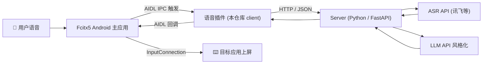

# Fcitx5 AI Voice-to-Text Core

用户语音输入 → ASR 转文字 → AI 风格化整理 → 输入法上屏。

例如讲话时想到什么说什么，AI 将其转化为更有逻辑、更正式的语言。

本项目是**核心协议与逻辑层**，外部可封装为 Fcitx5 Android / Linux / Windows 等平台的输入法插件。

## 架构



## 集成路径选择

已确定采用 **A 路径：Fcitx5 Android 插件**。

| 方案 | 说明 | 选择原因 |
|---|---|---|
| **A. Fcitx5 插件（AIDL IPC）** | 作为独立 APK 插件，通过 AIDL 与 Fcitx5 主应用通信 | ✅ 主应用持有 `InputConnection`，可直接上屏；便于收集用户修改反馈，形成数据闭环 |
| B. AnySoftKeyboard | 通过系统 `RecognizerIntent` 调用外部语音 IME | ❌ 无法控制上屏流程，难以获取用户后续修改 |
| C. 独立 App + 剪贴板 | 录音后写入剪贴板，用户手动粘贴 | ❌ 体验割裂，无反馈闭环 |

插件侧代码（AIDL 接口、`VoiceInputPluginService`、录音与网络核心）已完成；后续主要工作在 **Fcitx5 Android 主应用侧** 集成语音按钮与回调处理。

## 技术选型

| 层 | 语言/框架 | 说明 |
|---|---|---|
| **Client** | **Kotlin** | Fcitx5 Android 插件原生语言，直接调用 Android AudioRecord 录音 & Fcitx5 输入接口 |
| **Server** | **Python / FastAPI** | 原型阶段开发效率高，ASR + LLM 外部 API 封装方便；后续可迁移至 Go/Rust |
| **通信** | HTTP REST + JSON | 原型阶段最简方案，后续可升级为 gRPC / WebSocket |

## 项目结构

```
fcitx5-ai-voice-to-text-core/
├── client/                  # Android 客户端（Fcitx5 插件）
│   ├── app/                 # Android 应用模块（插件 APK）
│   │   ├── src/main/
│   │   │   ├── aidl/        # AIDL 接口：IVoiceInputPlugin / IVoiceInputCallback
│   │   │   ├── java/        # bridge / data / ui
│   │   │   └── res/         # 布局、字符串、Manifest
│   │   └── build.gradle.kts
│   ├── core/                # 纯 Kotlin 核心库（可单元测试）
│   │   └── src/main/kotlin/...
│   ├── PROGRESS.md          # 开发进度与路线规划
│   └── ARCHITECTURE.md      # 客户端架构设计文档
├── server/                  # 服务端（Python / FastAPI）
│   ├── app.py               # FastAPI 入口 / 路由层（只接线，不含业务逻辑）
│   ├── pipeline.py          # 编排层：校验 → ASR → 风格化 → 组装响应 + 错误处理
│   ├── asr.py               # ASR 层：抽象基类 + Mock 实现 + 工厂（可插拔 provider）
│   ├── stylize.py           # 风格化层：抽象基类 + 规则实现 + 工厂（可插拔 provider）
│   ├── models.py            # Pydantic 数据模型 + Style 风格枚举
│   ├── config.py            # 配置层：读取 .env / 环境变量
│   ├── feedback_store.py    # 反馈存储：JSONL 文件操作
│   ├── requirements.txt     # Python 依赖
│   └── environment.yml      # Conda 环境配置
├── .env.example             # 环境变量模板（复制为 .env 后填值）
├── BUILD_GUIDE.md           # 详细的构建指南
├── CLAUDE.md                # 开发指南
└── README.md                # 本文件
```

### 分层设计与「可插拔 provider」

各层职责单一，依赖方向单向（app → pipeline → asr/stylize → config/models）：

- **config.py** — 所有可调参数（provider、API key、大小上限、CORS）收敛于此，从 `.env` 读取。
- **asr.py / stylize.py** — 各自定义一个抽象基类和一个原型阶段的 mock 实现，由工厂函数按配置选择 provider。
- **pipeline.py** — 把流程串成一条线，并把可预期错误转成响应里的 `error` 字段，而非 500。
- **app.py** — 仅负责路由与中间件，逻辑全部下沉。

> 接入真实 ASR / LLM 时：新增一个继承基类的 provider 类 → 在该模块的 `_PROVIDERS` 注册 → 改 `.env` 里的 `ASR_PROVIDER` / `LLM_PROVIDER`。**核心代码与接口定义都不用改。**

## 通信协议

### 请求（Client → Server）

```json
{
  "audio": "<base64 编码的音频数据 / PCM / WAV>",
  "prompt": "请把这段话改得更正式",
  "sample": "您有一个新的会议邀请安排在下午三点……",
  "style": "正式"
}
```

### 响应（Server → Client）

成功：

```json
{
  "text": "您有一个新的会议邀请，安排在下午三点……",
  "original_text": "那个…下午三点有个会",
  "duration_ms": 1240,
  "error": null
}
```

可预期错误（如 base64 非法、音频超限）——HTTP 仍为 200，`error` 非空：

```json
{
  "text": "",
  "original_text": "",
  "duration_ms": 0,
  "error": "audio 字段不是合法的 base64 数据"
}
```

> 字段校验类错误（如 `style` 取值非法）由 FastAPI 在进入逻辑前拦下，返回 **422**。

## 风格系统

| 风格 | 说明 |
|---|---|
| `正式` | 口语 → 书面语，去除语气词 |
| `精简` | 去除冗余，保留核心信息 |
| `礼貌` | 调整语气，添加敬语 |
| `翻译_英文` | 翻译为英文并优化表达 |
| `自定义` | 用户通过 `prompt` 参数自由定义 |

## Quick Start（原型阶段）

### 1. 创建并激活 Python 虚拟环境

Windows PowerShell:

```powershell
cd C:\Users\17879\Desktop\claude\zqProject
py -3.11 -m venv .venv
.\.venv\Scripts\Activate.ps1
pip install -r requirements.txt
```

如果 `py` 没有注册，但知道 Python 安装路径，也可以使用完整路径：

```powershell
& 'C:\Users\17879\AppData\Local\Programs\Python\Python313\python.exe' -m venv .venv
.\.venv\Scripts\Activate.ps1
pip install -r requirements.txt -i https://pypi.tuna.tsinghua.edu.cn/simple
```

Conda:

```bash
conda env create -f server/environment.yml
conda activate fcitx5-voice
```

### 2. （可选）配置环境变量

```bash
cp .env.example .env
```

原型阶段无需任何配置即可运行（默认全部走 mock）。需要接真实 API 或收紧 CORS 时再编辑 `.env`。

### 3. 启动服务端

```bash
# 确保虚拟环境已激活
uvicorn server.app:app --reload --host 0.0.0.0 --port 8080
```

> `--reload` 仅在开发阶段使用，修改代码后自动重启。

### 4. 构建并安装插件 APK

```bash
cd client
./gradlew :app:assembleDebug
adb install app/build/outputs/apk/debug/app-debug.apk
```

详细构建指南参考 [BUILD_GUIDE.md](BUILD_GUIDE.md)。

### 5. 测试接口

```bash
# 健康检查
curl http://localhost:8080/health

# 转录测试
curl -X POST http://localhost:8080/v1/transcribe \
  -H "Content-Type: application/json" \
  -d '{"audio": "AAECAw==", "style": "精简"}'

# 返回示例：
# {"text":"[录音时长: 0ms] 好的。","original_text":"好的","duration_ms":0,"error":null}
```

## 后续规划（Roadmap）

- [x] **Phase 1** — 服务端 ASR + 风格化逻辑可独立运行
- [x] **Phase 2** — Kotlin Client 核心：录音 → 发送 → 接收 → 上屏
- [x] **Phase 3** — 插件侧 AIDL 接口与 `VoiceInputPluginService` 实现
- [ ] **Phase 4** — Fcitx5 Android 主应用集成：键盘按钮、bindService、回调上屏
- [ ] **Phase 5** — 用户修改反馈闭环：采集上屏后编辑 → 优化风格化 prompt
- [ ] **Phase 6** — Fcitx5 Linux / Windows 插件封装
- [ ] **Phase 7** — 自定义提示词模板管理 UI
- [ ] **Phase 8** — 离线 ASR / 端侧小模型支持

## 说明

- 本项目为**核心协议与逻辑层** + **Fcitx5 Android 插件 APK**。
- 当前插件侧代码可直接编译安装，但尚需 Fcitx5 Android 主应用配合才能在上屏流程中生效。
- 各平台插件（Linux / Windows）作为独立仓库，通过本项目定义的 Client API 进行对接。
- 详细的构建和部署指南请参考 [BUILD_GUIDE.md](BUILD_GUIDE.md)。
