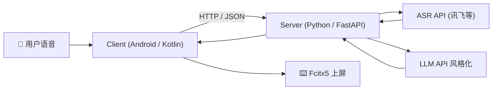

# Fcitx5 AI Voice-to-Text Core

用户语音输入 → ASR 转文字 → AI 风格化整理 → 输入法上屏。

例如讲话时想到什么说什么，AI 将其转化为更有逻辑、更正式的语言。

本项目是**核心协议与逻辑层**，外部可封装为 Fcitx5 Android / Linux / Windows 等平台的输入法插件。

## 架构



## 技术选型

| 层 | 语言/框架 | 说明 |
|---|---|---|
| **Client** | **Kotlin** | Fcitx5 Android 插件原生语言，直接调用 Android AudioRecord 录音 & Fcitx5 输入接口 |
| **Server** | **Python / FastAPI** | 原型阶段开发效率高，ASR + LLM 外部 API 封装方便；后续可迁移至 Go/Rust |
| **通信** | HTTP REST + JSON | 原型阶段最简方案，后续可升级为 gRPC / WebSocket |

## 项目结构

```
fcitx5-ai-voice-to-text-core/
├── client/                  # Android 客户端（Kotlin 模块）
│   └── (待开发)
├── server/                  # 服务端（Python / FastAPI）
│   ├── app.py              # FastAPI 入口 / API 路由
│   ├── asr.py              # ASR 转文字模块（当前固定模拟，后续接真实 API）
│   ├── stylize.py          # 风格化模块（当前固定模拟，后续接 LLM API）
│   ├── models.py           # Pydantic 数据模型
│   └── environment.yml     # Conda 环境配置
├── docs/
│   └── protocol.md         # 通信协议说明
└── README.md
```

## 通信协议

### 请求（Client → Server）

```json
{
  "audio": "<base64 编码的音频数据 / PCM / WAV>",
  "prompt": "请把这段话改得更正式",
  "sample": "您有一个新的会议邀请安排在下午三点……",
  "style": "正式"
}
```

### 响应（Server → Client）

```json
{
  "text": "您有一个新的会议邀请，安排在下午三点……",
  "original_text": "那个…下午三点有个会",
  "duration_ms": 1240,
  "error": null
}
```

## 风格系统

| 风格 | 说明 |
|---|---|
| `正式` | 口语 → 书面语，去除语气词 |
| `精简` | 去除冗余，保留核心信息 |
| `礼貌` | 调整语气，添加敬语 |
| `翻译_英文` | 翻译为英文并优化表达 |
| `自定义` | 用户通过 `prompt` 参数自由定义 |

## Quick Start（原型阶段）

### 1. 创建并激活 Conda 环境

```bash
cd server
conda env create -f environment.yml
conda activate fcitx5-voice
```

### 2. 启动服务端

```bash
# 确保 conda 环境已激活 (fcitx5-voice)
uvicorn server.app:app --reload --host 0.0.0.0 --port 8080
```

> `--reload` 仅在开发阶段使用，修改代码后自动重启。

### 3. 测试接口

```bash
# 健康检查
curl http://localhost:8080/health

# 转录测试 — 发送不同长度的音频数据，返回不同模拟结果
curl -X POST http://localhost:8080/v1/transcribe \
  -H "Content-Type: application/json" \
  -d '{"audio": "AAECAw==", "style": "精简"}'

# 返回示例：
# {"text":"好的。","original_text":"好的","duration_ms":0,"error":null}
```

## 后续规划（Roadmap）

- [ ] **Phase 1** — 服务端 ASR + 风格化逻辑可独立运行（当前原型目标）
- [ ] **Phase 2** — Kotlin Client 核心：录音 → 发送 → 接收 → 上屏
- [ ] **Phase 3** — 封装为 Fcitx5 Android 插件
- [ ] **Phase 4** — Fcitx5 Linux / Windows 插件封装
- [ ] **Phase 5** — 自定义提示词模板管理 UI
- [ ] **Phase 6** — 离线 ASR / 端侧小模型支持

## 说明

- 本项目为**核心协议与逻辑层**，不直接包含 Fcitx5 插件代码。
- 各平台插件作为独立仓库，通过本项目定义的 Client API 进行对接。