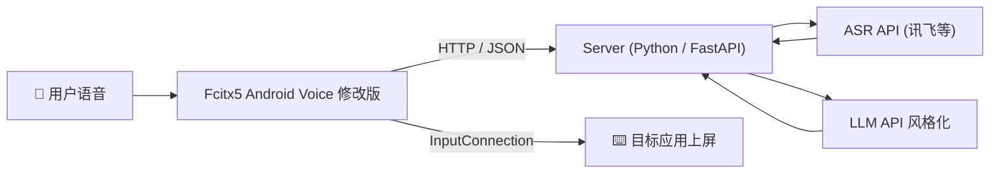

# Fcitx5 AI Voice-to-Text Core

用户语音输入 → ASR 转文字 → AI 风格化整理 → 输入法上屏。

例如讲话时想到什么说什么，AI 将其转化为更有逻辑、更正式的语言。

本项目作为server存在，client参考 https://github.com/qytlix/fcitx5-android 。

## 架构




## 技术选型

| 层 | 语言/框架 | 说明 |
|---|---|---|
| **Client** | **Kotlin** | 修改 Fcitx5 代码，添加录音功能，和服务端通信 |
| **Server** | **Python / FastAPI** | 原型阶段开发效率高，ASR + LLM 外部 API 封装方便；后续可迁移至 Go/Rust |
| **通信** | HTTP REST + JSON | 原型阶段最简方案，后续可升级为 gRPC / WebSocket |

## 项目结构

```
fcitx5-ai-voice-to-text-core/
├── server/                  # 服务端（Python / FastAPI）
│   ├── app.py               # FastAPI 入口 / 路由层（只接线，不含业务逻辑）
│   ├── pipeline.py          # 编排层：校验 → ASR → 风格化 → 组装响应 + 错误处理
│   ├── asr.py               # ASR 层：抽象基类 + Mock 实现 + 工厂（可插拔 provider）
│   ├── stylize.py           # 风格化层：抽象基类 + 规则实现 + 工厂（可插拔 provider）
│   ├── models.py            # Pydantic 数据模型 + Style 风格枚举
│   ├── config.py            # 配置层：读取 .env / 环境变量
│   ├── feedback_store.py    # 反馈存储：JSONL 文件操作
│   ├── requirements.txt     # Python 依赖
│   └── environment.yml      # Conda 环境配置
├── .env.example             # 环境变量模板（复制为 .env 后填值）
├── deploy/                  # Docker 部署配置
│   ├── Dockerfile           # Docker 镜像定义
│   ├── docker-compose.yml   # Docker Compose 编排
│   └── .dockerignore        # Docker 忽略规则
├── docs/                    # 文档
│   ├── API.md               # 服务端 API 文档
│   ├── DOCKER.md            # Docker 部署指南
│   └── xfyun使用说明.md      # 讯飞集成说明
├── test/                    # 测试脚本
│   └── test_xunfei.py       # 讯飞 ASR 测试
├── CLAUDE.md                # 开发指南
└── README.md                # 本文件
```

### 分层设计与「可插拔 provider」

各层职责单一，依赖方向单向（app → pipeline → asr/stylize → config/models）：

- **config.py** — 所有可调参数（provider、API key、大小上限、CORS）收敛于此，从 `.env` 读取。
- **asr.py / stylize.py** — 各自定义一个抽象基类和一个原型阶段的 mock 实现，由工厂函数按配置选择 provider。
- **pipeline.py** — 把流程串成一条线，并把可预期错误转成响应里的 `error` 字段，而非 500。
- **app.py** — 仅负责路由与中间件，逻辑全部下沉。

> 接入真实 ASR / LLM 时：新增一个继承基类的 provider 类 → 在该模块的 `_PROVIDERS` 注册 → 改 `.env` 里的 `ASR_PROVIDER` / `LLM_PROVIDER`。**核心代码与接口定义都不用改。**

## 通信协议

### 请求（Client → Server）

```json
{
  "audio": "<base64 编码的音频数据 / PCM / WAV>",
  "prompt": "请把这段话改得更正式",
  "sample": "您有一个新的会议邀请安排在下午三点……",
  "style": "正式"
}
```

### 响应（Server → Client）

成功：

```json
{
  "text": "您有一个新的会议邀请，安排在下午三点……",
  "original_text": "那个…下午三点有个会",
  "duration_ms": 1240,
  "error": null
}
```

可预期错误（如 base64 非法、音频超限）——HTTP 仍为 200，`error` 非空：

```json
{
  "text": "",
  "original_text": "",
  "duration_ms": 0,
  "error": "audio 字段不是合法的 base64 数据"
}
```

> 字段校验类错误（如 `style` 取值非法）由 FastAPI 在进入逻辑前拦下，返回 **422**。

## 风格系统

| 风格 | 说明 |
|---|---|
| `正式` | 口语 → 书面语，去除语气词 |
| `精简` | 去除冗余，保留核心信息 |
| `礼貌` | 调整语气，添加敬语 |
| `翻译_英文` | 翻译为英文并优化表达 |
| `自定义` | 用户通过 `prompt` 参数自由定义 |

## 快速开始

### Docker 部署（推荐）

```bash
# 1. 克隆项目
git clone https://github.com/your-username/zqProject.git
cd zqProject

# 2. 配置环境变量
cp .env.example .env
# 编辑 .env 填入讯飞凭证

# 3. 启动服务
docker compose -f deploy/docker-compose.yml up -d

# 4. 验证服务
curl http://localhost:8080/health
```

详见 [docs/DOCKER.md](docs/DOCKER.md) 和 [docs/API.md](docs/API.md)。

### 本地开发

```bash
# 创建虚拟环境
python -m venv .venv
source .venv/bin/activate  # Linux/Mac
.venv\Scripts\activate      # Windows

# 安装依赖
pip install -r server/requirements.txt

# 配置环境变量
cp .env.example .env
PYTHONIOENCODING=utf-8 uvicorn server.app:app --reload --port 8080
```

### 测试接口

```bash
# 健康检查
curl http://localhost:8080/health

# 转录测试
curl -X POST http://localhost:8080/v1/transcribe \
  -H "Content-Type: application/json" \
  -d '{"audio": "UklGRiYAAABXQVZFZm10IBAAAAABAAEAQB8AAAB9AAACABAAZGF0YQIAAAAAAA==", "style": "正式"}'
```

更多示例见 [docs/API.md](docs/API.md)。
