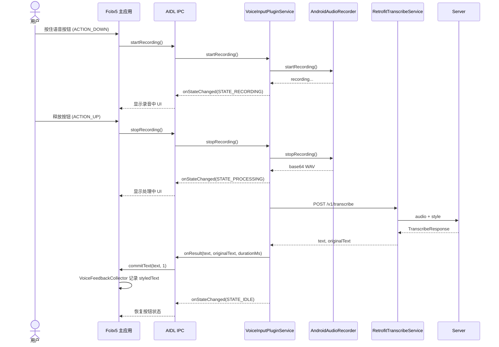
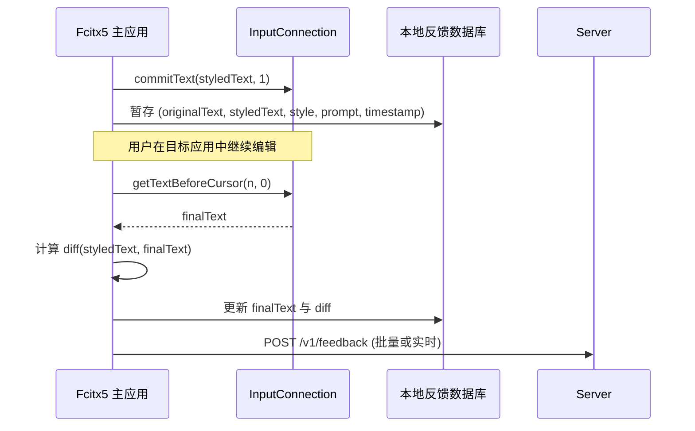

# Fcitx5 AI Voice-to-Text Client — 架构设计文档

## 1. 概述

### 1.1 目标

构建一个 Kotlin Android 客户端，作为 Fcitx5 Android 输入法的**语音输入插件**，实现以下完整链路：

```
用户语音 → 录音 → ASR 转文字 → AI 风格化整理 → Fcitx5 上屏
```

### 1.2 运行环境

- **宿主**: Fcitx5 Android (`org.fcitx.fcitx5.android`)
- **集成方式**: 独立 APK 插件，通过 AIDL IPC 与 Fcitx5 主应用通信
  - 插件 Action: `org.fcitx.fcitx5.android.plugin.SERVICE`
  - 插件包名: `org.fcitx.fcitx5.android.voice`（暂定）
  - 主应用通过 `bindService()` 绑定插件，注册 `IVoiceInputCallback` 接收结果
- **最低 SDK**: Android 8.0 (API 26)

### 1.3 设计原则

| 原则 | 说明 |
|------|------|
| **松耦合** | 录音、网络、上屏三模块通过接口隔离，可独立替换 |
| **可测试** | 核心逻辑通过接口抽象，可提供 Mock 实现进行单元测试 |
| **Fcitx5 原生集成** | 复用 Fcitx5 Android 插件机制，不做重复轮子 |
| **反馈闭环** | 利用 IME 级 InputConnection 采集用户后续编辑，持续优化风格化效果 |

---

## 2. 项目模块结构

```
client/
├── app/                          # Android 应用主模块（作为 Fcitx5 插件）
│   ├── src/main/java/org/fcitx/fcitx5/android/voice/
│   │   ├── bridge/               # Fcitx5 集成桥接层
│   │   ├── data/                 # 数据层（网络、录音、状态）
│   │   ├── domain/               # 业务逻辑层
│   │   ├── ui/                   # UI 层（设置界面等）
│   │   └── di/                   # 依赖注入（手动 / Hilt）
│   └── build.gradle.kts
├── core/                         # 纯 Kotlin 库，零 Android 依赖（可选）
│   └── src/main/kotlin/org/fcitx/fcitx5/android/voice/core/
│       ├── model/                # 数据模型（与 server 共用定义）
│       └── network/              # HTTP 客户端抽象
└── ARCHITECTURE.md               # 本文件
```

> **说明**: 客户端以 Fcitx5 Android 插件形式发布，遵循 Fcitx5 Android 的 Plugin System 约定。

---

## 3. 包结构与核心接口

### 3.1 `bridge` — Fcitx5 集成桥接层

负责与 Fcitx5 Android 主应用的 IPC 通信。

```kotlin
package org.fcitx.fcitx5.android.voice.bridge

/**
 * Fcitx5 上屏接口抽象。
 * 解耦核心业务逻辑与 Fcitx5 输入法服务。
 * 提供 Mock 实现用于单元测试。
 */
interface CommitTextHandler {
    /** 提交最终文本到当前输入框 */
    fun commitText(text: String)
}

/**
 * Fcitx5 Android 语音输入插件服务。
 *
 * 作为 AIDL-bound Service 被 Fcitx5 主应用发现和绑定。
 * 在独立进程 `:fcitx_plugin_voice` 中运行。
 */
class VoiceInputPluginService : Service() {

    private val binder = object : IVoiceInputPlugin.Stub() {
        override fun startRecording() { /* ... */ }
        override fun stopRecording() { /* ... */ }
        override fun cancelRecording() { /* ... */ }
        override fun setStyle(style: String) { /* ... */ }
        override fun registerCallback(callback: IVoiceInputCallback?) { /* ... */ }
        override fun isRecording(): Boolean { /* ... */ }
        override fun getVersion(): String { /* ... */ }
    }
}
```

AIDL 接口定义：

```aidl
// IVoiceInputPlugin.aidl
interface IVoiceInputPlugin {
    void startRecording();              // 开始录音
    void stopRecording();               // 停止录音 → 转录 → 回调
    void cancelRecording();             // 取消（丢弃音频）
    void setStyle(String style);        // 设置风格
    void registerCallback(IVoiceInputCallback callback);  // 注册回调
    boolean isRecording();              // 查询状态
    String getVersion();                // 获取版本
}
```

```aidl
// IVoiceInputCallback.aidl
interface IVoiceInputCallback {
    void onResult(String text, String originalText, long durationMs);
    void onError(String message);
    void onStateChanged(int state);     // STATE_IDLE=0 / STATE_RECORDING=1 / STATE_PROCESSING=2

    const int STATE_IDLE = 0;
    const int STATE_RECORDING = 1;
    const int STATE_PROCESSING = 2;
}
```

### 3.2 `data` — 数据层

```kotlin
package org.fcitx.fcitx5.android.voice.data

import android.Manifest
import android.media.AudioRecord

/**
 * 音频录音接口。
 * 负责采集麦克风音频并转为 base64 PCM/WAV。
 */
interface AudioRecorder {
    /** 权限需求 */
    val requiredPermissions: List<String>
        get() = listOf(Manifest.permission.RECORD_AUDIO)
    
    /** 开始录音 */
    suspend fun startRecording()
    
    /** 停止录音并返回 base64 编码的音频数据 */
    suspend fun stopRecording(): String
    
    /** 当前是否正在录音 */
    val isRecording: Boolean
}

/**
 * Android AudioRecord 实现。
 * 采样率 16000Hz，单声道，16-bit PCM。
 * 输出 WAV 格式 base64。
 */
class AndroidAudioRecorder(
    private val sampleRate: Int = 16000,
    private val channelConfig: Int = AudioRecord.CHANNEL_IN_MONO,
    private val audioFormat: Int = AudioRecord.ENCODING_PCM_16BIT
) : AudioRecorder {
    // 实现细节: AudioRecord → ByteArray → WAV header → Base64
}

/**
 * 语音转录网络服务接口。
 */
interface TranscribeService {
    /** 发送音频并返回风格化结果 */
    suspend fun transcribe(request: TranscribeRequest): TranscribeResponse
}

/**
 * Retrofit 实现的 HTTP 客户端，对接服务端 /v1/transcribe。
 */
class RetrofitTranscribeService(
    private val baseUrl: String = "http://localhost:8080"
) : TranscribeService {
    
    private val api: TranscribeApi = Retrofit.Builder()
        .baseUrl(baseUrl)
        .addConverterFactory(GsonConverterFactory.create())
        .build()
        .create(TranscribeApi::class.java)
    
    private interface TranscribeApi {
        @POST("/v1/transcribe")
        suspend fun transcribe(@Body request: TranscribeRequest): TranscribeResponse
    }
    
    override suspend fun transcribe(request: TranscribeRequest): TranscribeResponse {
        return api.transcribe(request)
    }
}
```

### 3.3 `domain` — 业务逻辑层

```kotlin
package org.fcitx.fcitx5.android.voice.domain

/**
 * 语音转录用例 — 协调录音 → 发送 → 接收 → 上屏的完整流程。
 */
class TranscribeUseCase(
    private val audioRecorder: AudioRecorder,
    private val transcribeService: TranscribeService,
    private val commitTextHandler: CommitTextHandler
) {
    /** 开始录音（两段式第一段） */
    suspend fun startRecording()

    /** 停止录音并转录（两段式第二段） */
    suspend fun stopRecordingAndTranscribe(
        style: String = "正式",
        prompt: String? = null,
        sample: String? = null
    ): TranscribeResult

    /**
     * 一站式执行：录音 → 发送 → 上屏。
     * 也可通过 audioSource 直接传入 base64 音频跳过录音。
     */
    suspend fun execute(
        style: String = "正式",
        prompt: String? = null,
        sample: String? = null,
        audioSource: String? = null
    ): TranscribeResult
}

/**
 * 录音管理用例 — 管理录音生命周期与权限。
 */
class RecordingUseCase(
    private val audioRecorder: AudioRecorder
) {
    /** 检查并请求录音权限 */
    suspend fun ensurePermission(): Boolean
    
    /** 估算录音时长（基于数据量） */
    fun estimateDuration(base64Audio: String): Long
}

/**
 * 用例执行过程中发射的状态变更。
 */
sealed class TranscribeState {
    /** 空闲 */
    data object Idle : TranscribeState()
    
    /** 等待权限 */
    data object WaitingForPermission : TranscribeState()
    
    /** 录音中 */
    data class Recording(val durationMs: Long) : TranscribeState()
    
    /** 音频处理中（编码） */
    data object ProcessingAudio : TranscribeState()
    
    /** 发送请求中 */
    data object Transcribing : TranscribeState()
    
    /** 完成 */
    data class Success(
        val text: String,
        val originalText: String,
        val durationMs: Long
    ) : TranscribeState()
    
    /** 失败 */
    data class Error(val message: String, val code: Int?) : TranscribeState()
}

/**
 * 转录结果数据类。
 */
data class TranscribeResult(
    val text: String,
    val originalText: String,
    val serverDurationMs: Long?,
    val totalDurationMs: Long
)
```

### 3.4 `ui` — UI 层

```kotlin
package org.fcitx.fcitx5.android.voice.ui

/**
 * 语音输入按钮组件状态管理。
 * 作为插件，UI 以悬浮按钮/键盘按键形式存在。
 */
sealed class VoiceButtonState {
    data object Idle : VoiceButtonState()
    data object Ready : VoiceButtonState()      // 权限已获取，可录音
    data object Recording : VoiceButtonState()   // 录音中（可闪烁/动画）
    data object Processing : VoiceButtonState()  // 请求中（加载动画）
    data object Success : VoiceButtonState()     // 完成（短暂显示后恢复 Idle）
    data class Error(val message: String) : VoiceButtonState()
}

/**
 * ViewModel 管理 UI 状态与用户交互。
 */
class VoiceInputViewModel(
    private val transcribeUseCase: TranscribeUseCase
) : ViewModel() {
    
    private val _state = MutableStateFlow<VoiceButtonState>(VoiceButtonState.Idle)
    val state: StateFlow<VoiceButtonState> = _state.asStateFlow()
    
    /** 用户点击语音按钮时调用 */
    fun onVoiceButtonClicked()
    
    /** 用户长按取消时调用 */
    fun onVoiceInputCancelled()
}
```

---

## 4. 数据流详解

### 4.1 完整流程

```
┌──────────┐    ┌───────────┐    ┌──────────────┐    ┌──────────┐    ┌──────────────┐
│ 用户     │    │ ViewModel │    │ Transcribe   │    │ Server   │    │ CommitText   │
│ (UI操作) │    │           │    │ UseCase      │    │ (FastAPI)│    │ Handler      │
└────┬─────┘    └─────┬─────┘    └──────┬───────┘    └────┬─────┘    └──────┬───────┘
     │                │                 │                 │                │
     │ 点击语音按钮   │                 │                 │                │
     │───────────────>│                 │                 │                │
     │                │ 启动录音        │                 │                │
     │                │───────────────>│                 │                │
     │                │   State:       │                 │                │
     │   UI显示录音中  │   Recording    │                 │                │
     │<───────────────│                 │                 │                │
     │                │                 │                 │                │
     │ 再次点击停止   │                 │                 │                │
     │───────────────>│ 停止录音 →     │                 │                │
     │                │  编码为 base64  │                 │                │
     │                │   State:       │                 │                │
     │   UI显示处理中  │ Transcribing   │                 │                │
     │<───────────────│                 │                 │                │
     │                │  POST /v1/transcribe             │                │
     │                │─────────────────────────────────>│                │
     │                │                 │                 │                │
     │                │  {              │                 │                │
     │                │    audio:...,   │                 │                │
     │                │    style:"正式" │                 │                │
     │                │  }              │                 │                │
     │                │                 │                 │                │
     │                │ response:       │                 │                │
     │                │ {text:"...",...}│                 │                │
     │                │<─────────────────────────────────│                │
     │                │                 │                 │                │
     │                │  commitText()    │                │                │
     │                │──────────────────────────────────────────────>│
     │                │                 │                 │   文字上屏    │
     │                │   State:        │                 │               │
     │   UI恢复空闲   │   Success       │                 │                │
     │<───────────────│                 │                 │                │
```

### 4.2 各步骤详细说明

| 步骤 | 组件 | 行为 |
|------|------|------|
| **1. 触发** | VoiceInputViewModel | 用户点击语音按钮，检查权限 → 调用 RecordingUseCase.start() |
| **2. 录音** | AndroidAudioRecorder | AudioRecord 采集 16kHz/16-bit/单声道 PCM 流数据到 ByteArray |
| **3. 编码** | AndroidAudioRecorder | PCM → WAV（添加 RIFF header） → Base64 编码 |
| **4. 请求** | RetrofitTranscribeService | HTTP POST 到 /v1/transcribe，请求体含 audio/style/prompt |
| **5. 响应** | RetrofitTranscribeService | 解析 TranscribeResponse JSON |
| **6. 提交** | CommitTextHandler | 通过 Fcitx5 InputConnection 将结果文字提交到当前编辑框 |
| **7. 反馈** | VoiceInputViewModel | StateFlow 更新 UI 状态触发视觉反馈 |

---

## 5. Fcitx5 集成方案

### 5.1 集成层级

```
┌─────────────────────────────────────────────────────┐
│  目标应用编辑框 (EditText / WebView / 富文本)          │
│  ↑ Android InputConnection                            │
├─────────────────────────────────────────────────────┤
│  Fcitx5 Android 主应用                                │
│  ├─ FcitxInputMethodService                         │
│  │  ├─ 键盘 UI（语音按钮）                            │
│  │  ├─ VoiceInputManager（bind / callback）          │
│  │  └─ InputConnection.commitText()                 │
│  └─ VoiceFeedbackCollector（采集用户修改）             │
├─────────────────────────────────────────────────────┤
│  AIDL IPC（跨进程）                                    │
│  ├─ IVoiceInputPlugin  ← 主应用调用插件               │
│  └─ IVoiceInputCallback ← 插件回调结果                │
├─────────────────────────────────────────────────────┤
│  语音输入插件 APK（本仓库 client/app）                 │
│  ├─ VoiceInputPluginService                         │
│  ├─ AndroidAudioRecorder                            │
│  ├─ RetrofitTranscribeService                       │
│  └─ TranscribeUseCase                               │
└─────────────────────────────────────────────────────┘
```

### 5.2 集成方式：Fcitx5 Android 插件（已选定）

本项目作为独立 APK 插件运行，通过 AIDL 与 Fcitx5 Android 主应用双向通信：

1. **插件 APK** 在 `AndroidManifest.xml` 中声明 `VoiceInputPluginService`，并注册 `org.fcitx.fcitx5.android.plugin.SERVICE` action
2. **主应用**通过 `bindService()` 显式绑定插件（包名 + action）
3. 主应用调用 `IVoiceInputPlugin.startRecording()` / `stopRecording()` 控制录音
4. 插件完成录音、编码、HTTP 请求后，通过 `IVoiceInputCallback.onResult()` 回调结果
5. 主应用在回调中调用 `InputConnection.commitText()` 完成上屏

Manifest 配置（已在本仓库实现）：
```xml
<service
    android:name=".bridge.VoiceInputPluginService"
    android:exported="true"
    android:process=":fcitx_plugin_voice"
    android:description="@string/plugin_description">
    <intent-filter>
        <action android:name="org.fcitx.fcitx5.android.plugin.SERVICE" />
    </intent-filter>
</service>
```

### 5.3 插件交互时序图



### 5.4 主应用需要新增/修改的模块

| 模块 | 职责 | 关键文件/类 |
|---|---|---|
| AIDL 集成 | 拷贝 AIDL 文件并启用 aidl build feature | `IVoiceInputPlugin.aidl`, `IVoiceInputCallback.aidl` |
| 语音按钮 | 在键盘 UI 提供触发入口 | `KeyboardView` / Toolbar 布局 XML |
| 插件连接管理 | bindService / 生命周期 / 异常恢复 | `VoiceInputManager` |
| 回调实现 | 接收结果并上屏 | `IVoiceInputCallback.Stub` |
| 反馈采集 | 读取输入框最终文本，计算与上屏文本差异 | `VoiceFeedbackCollector` |

### 5.5 备选方案说明

已排除以下方案：

| 方案 | 排除原因 |
|---|---|
| AnySoftKeyboard | 使用系统 `RecognizerIntent`，无法获取 InputConnection 与后续修改 |
| 独立 App + 剪贴板 | 体验割裂，需要用户手动粘贴 |
| AccessibilityService | 需要额外权限，无法替代 IME 上屏体验 |

---

## 6. 状态管理

### 6.1 全局状态机

```
     ┌────────────────────────────────────────────┐
     │                                            │
     ▼                                            │
   ┌──────┐   权限OK   ┌────────┐   点击按钮   ┌───────────┐
   │ Idle │──────────→│  Ready  │────────────→│ Recording  │
   └──┬───┘           └────────┘              └─────┬─────┘
      │                                              │
      │  权限拒绝                                     │ 再次点击
      ▼                                              ▼
   ┌───────────┐                               ┌────────────┐
   │ Error:    │                               │ Processing │
   │ 无权限    │                               │ (编码+发送) │
   └───────────┘                               └──────┬─────┘
                                                      │
                                              ┌───────┴───────┐
                                              │               │
                                              ▼               ▼
                                        ┌────────┐     ┌───────────┐
                                        │ Success│     │ Error     │
                                        │ (上屏) │     │ (显示错误) │
                                        └───┬────┘     └─────┬─────┘
                                            │                │
                                            ▼                ▼
                                         ┌──────────────────────┐
                                         │   Idle (自动恢复)     │
                                         └──────────────────────┘
```

### 6.2 状态流转实现

ViewModel 中使用 `StateFlow<VoiceButtonState>` 管理状态，UI 层收集此 Flow 驱动视觉变化。

关键状态转换逻辑：
- `Idle → Ready`：录音权限已获取
- `Ready → Recording`：开始录音
- `Recording → Processing`：录音结束，正在编码 + 网络请求
- `Processing → Success`：收到服务器响应，文字已上屏（短暂显示后自动回 Idle）
- `Processing → Error`：网络错误/服务器错误
- `Error → Idle`：用户确认错误后恢复

---

## 7. 错误处理策略

### 7.1 错误分类

| 错误类型 | 来源 | 处理方式 |
|----------|------|----------|
| 无录音权限 | Android 系统 | 请求权限，拒绝则提示用户前往设置 |
| 录音失败 | AudioRecord | 提示"录音失败"，回退到 Idle |
| 网络连接失败 | Retrofit/OkHttp | 提示"网络不可用"，自动重试 1 次 |
| 服务器错误 | FastAPI (5xx) | 提示"服务暂时不可用" |
| 超时 | OkHttp (30s) | 提示"请求超时，请重试" |
| 服务器返回错误 | TranscribeResponse.error | 显示具体错误信息 |

### 7.2 重试策略

```kotlin
/**
 * 网络请求重试策略。
 * 使用 OkHttp 拦截器或 Kotlin Coroutines Retry 实现。
 */
object RetryPolicy {
    /** 最大重试次数 */
    const val MAX_RETRIES = 1
    
    /** 重试间隔（毫秒） */
    const val RETRY_DELAY_MS = 1000L
    
    /** 是否应该重试（仅对连接类错误重试） */
    fun shouldRetry(error: Throwable): Boolean = when (error) {
        is java.net.ConnectException -> true
        is java.net.SocketTimeoutException -> true
        is java.net.UnknownHostException -> true
        else -> false
    }
}
```

### 7.3 超时控制

| 阶段 | 超时时间 | 说明 |
|------|----------|------|
| 录音 | 无限制（用户手动停止） | 最长建议 60s |
| HTTP 请求 | 30s | OkHttp 默认连接超时 |
| 总流程 | 60s | UseCase 级别兜底超时 |

---

## 8. 依赖管理

### 8.1 核心依赖

```
// 网络层
implementation("com.squareup.retrofit2:retrofit:2.9.0")
implementation("com.squareup.retrofit2:converter-gson:2.9.0")
implementation("com.squareup.okhttp3:okhttp:4.12.0")
implementation("com.squareup.okhttp3:logging-interceptor:4.12.0")

// 异步
implementation("org.jetbrains.kotlinx:kotlinx-coroutines-android:1.8.0")

// AndroidX
implementation("androidx.lifecycle:lifecycle-viewmodel-ktx:2.7.0")
implementation("androidx.lifecycle:lifecycle-runtime-ktx:2.7.0")

// 序列化 (base64 标准库已支持)
// 无需额外依赖
```

### 8.2 可选依赖

```
// 依赖注入（项目规模增大后可引入）
implementation("com.google.dagger:hilt-android:2.50")
kapt("com.google.dagger:hilt-compiler:2.50")

// 音频处理（如需要更复杂的 WAV/压缩操作）
implementation("it.sauronsoftware:jave:1.0.2")  // 或其他音频库
```

---

## 9. 关键类职责总览

| 类/接口 | 职责 | 依赖 |
|---------|------|------|
| `AudioRecorder` | 录音接口抽象 | Android AudioRecord |
| `AndroidAudioRecorder` | AudioRecord 实现，输出 base64 WAV | AudioRecorder |
| `TranscribeService` | 网络请求抽象 | Retrofit/OkHttp |
| `RetrofitTranscribeService` | Retrofit 实现，调用 /v1/transcribe | TranscribeService |
| `TranscribeUseCase` | 核心业务编排 | AudioRecorder + TranscribeService + CommitTextHandler |
| `RecordingUseCase` | 录音权限与时长管理 | AudioRecorder |
| `CommitTextHandler` | 上屏接口抽象 | Fcitx5 / InputConnection |
| `Fcitx5CommitTextHandler` | Fcitx5 集成实现 | CommitTextHandler |
| `VoiceInputViewModel` | UI 状态管理 | TranscribeUseCase |
| `VoiceInputPluginService` | Fcitx5 插件服务（AIDL） | 所有上层 |
| `TranscribeRequest` | API 请求数据模型 | — |
| `TranscribeResponse` | API 响应数据模型 | — |

---

## 10. 测试策略

### 10.1 单元测试（核心逻辑）

| 测试目标 | 测试内容 | Mock 对象 |
|----------|---------|-----------|
| `RecordingUseCase` | 权限检查、时长估算 | AudioRecorder |
| `TranscribeUseCase` | 完整流程编排、错误处理 | AudioRecorder + TranscribeService + CommitTextHandler |
| `VoiceInputViewModel` | 状态转换、按钮点击处理 | TranscribeUseCase |

### 10.2 集成测试

| 测试目标 | 测试内容 |
|----------|---------|
| `AndroidAudioRecorder` | 真实录音 → 编码 → base64 输出验证 |
| `RetrofitTranscribeService` | 对接真实 Server 的 HTTP 请求/响应 |

### 10.3 Mock 实现

```kotlin
package org.fcitx.fcitx5.android.voice.test

/**
 * Mock 录音器 — 返回固定 base64 音频数据，用于测试 UseCase。
 */
class MockAudioRecorder : AudioRecorder {
    override val isRecording: Boolean = false
    
    override suspend fun startRecording() { /* 空实现 */ }
    
    override suspend fun stopRecording(): String {
        return "AAECAwQFBgcICQoLDA0ODxAREhMUFRYXGBkaGxwdHh8=" // mock base64
    }
}

/**
 * Mock 网络服务 — 返回固定响应，不发起真实 HTTP 请求。
 */
class MockTranscribeService : TranscribeService {
    override suspend fun transcribe(request: TranscribeRequest): TranscribeResponse {
        return TranscribeResponse(
            text = "好的，这是一个测试响应。",
            originalText = "好的 这是一个 测试 响应",
            durationMs = 42,
            error = null
        )
    }
}

/**
 * Mock 上屏处理器 — 仅输出日志，不实际提交。
 */
class MockCommitTextHandler : CommitTextHandler {
    var lastCommittedText: String? = null
    
    override fun commitText(text: String) {
        lastCommittedText = text
        println("[Mock] commitText: $text")
    }
    
    override fun setComposingText(text: String) {
        println("[Mock] setComposingText: $text")
    }
    
    override fun clearComposingText() {
        println("[Mock] clearComposingText")
    }
}
```

---

## 11. 后续扩展考虑

| 需求 | 影响范围 | 修改方式 |
|------|---------|----------|
| WebSocket 流式传输 | TranscribeService | 添加新的实现类，接口不变 |
| 离线 ASR | AudioRecorder + TranscribeService | 本地模型处理后直接走 CommitTextHandler |
| 自定义提示词模板 | VoiceInputViewModel + UI | 新增 UseCase + UI 设置页 |
| 多语言支持 | 所有层 | strings.xml 国际化 |
| 自动语音检测 (VAD) | AndroidAudioRecorder | 在录音阶段加入静音检测 |
| 热词/个性化字典 | TranscribeService | 在请求中加入 `prompt`/`sample` 参数 |

---

## 12. 数据模型定义

```kotlin
package org.fcitx.fcitx5.android.voice.data.model

/**
 * 与 server/models.py 保持一致的请求模型。
 */
data class TranscribeRequest(
    val audio: String,              // base64 编码的音频数据
    val prompt: String? = null,     // 自定义提示词
    val sample: String? = null,     // 样例文本
    val style: String = "正式"       // 风格：正式 / 精简 / 礼貌 / 翻译_英文 / 自定义
)

/**
 * 与 server/models.py 保持一致的响应模型。
 */
data class TranscribeResponse(
    val text: String,               // 风格化后的文字
    val original_text: String,      // ASR 原始转写
    val duration_ms: Int? = null,   // 服务端处理耗时
    val error: String? = null       // 错误信息
)
```

---

## 13. 用户修改反馈闭环

为了持续优化 AI 风格化效果，主应用需要采集“上屏后用户又修改了什么”。这一闭环只有在 IME 层级才能实现，也是选择 Fcitx5 插件路径（A 路径）而非独立 App / AnySoftKeyboard 的核心原因。

### 13.1 反馈数据模型

```kotlin
data class VoiceFeedbackEvent(
    val id: String,                   // 本次语音输入会话 ID
    val originalText: String,         // ASR 原始转写
    val styledText: String,           // AI 风格化后上屏的文本
    val finalText: String,            // 用户最终确认的文本
    val style: String,                // 使用的风格
    val prompt: String?,              // 自定义提示词
    val durationMs: Long,             // 处理耗时
    val timestamp: Long               // 事件发生时间
)
```

### 13.2 采集流程



### 13.3 触发采集的时机

| 时机 | 说明 | 优缺点 |
|---|---|---|
| 输入框失去焦点 | `onFinishInput()` 时读取 | 简单，但可能错过同会话内的多次修改 |
| 下次获得焦点 | `onStartInput()` 时读取上次内容 | 能获取到最终文本，延迟较长 |
| 用户再次点击语音按钮 | 再次录音前读取 | 最贴近使用场景，推荐 |
| 定时轮询 | 每 N 秒读取一次 | 实时性好，但耗电且复杂 |

**推荐组合**：用户再次点击语音按钮时读取 + `onFinishInput()` 作为兜底。

### 13.4 差异计算

使用 Myer 差分算法或 Android `DiffUtil` 计算 `styledText` 到 `finalText` 的最小变更集：

```kotlin
val diff = DiffUtil.calculateDiff(
    TextDiffCallback(styledText, finalText)
)
// 输出：插入、删除、替换的位置与内容
```

仅当差异比例超过阈值（如 10%）时才视为有效反馈，避免记录无意义的标点调整。

### 13.5 服务端接口（后续实现）

```http
POST /v1/feedback
Content-Type: application/json

{
  "original_text": "那个 下午三点 有个会",
  "styled_text": "下午三点有个会。",
  "final_text": "您有一个新的会议邀请，安排在下午三点。",
  "style": "正式",
  "prompt": null,
  "duration_ms": 1240,
  "timestamp": 1718500000000
}
```

服务端将反馈数据存入数据集，用于：

1. 优化各风格对应的 system prompt
2. 筛选 badcase 进行人工标注
3. 未来微调小模型或训练 LoRA

### 13.6 主应用新增模块

| 类/模块 | 职责 |
|---|---|
| `VoiceFeedbackCollector` | 在合适时机读取输入框内容，计算与上屏文本的差异 |
| `FeedbackRepository` | 本地缓存反馈事件，支持批量上传与导出 |
| `FeedbackUploader` | 调用 `POST /v1/feedback` |
| `TextDiffCallback` | 封装 `DiffUtil` 计算文本差异 |

---